# SQL 13

- 1

SELECT * 
FROM Employees
- 2 

SELECT ProductID, ProductName 
FROM Products;
- 4 

SELECT * 
FROM Orders 
WHERE CustomerID = (
    SELECT CustomerID 
    FROM Customers 
    WHERE CustomerName = "Around the Horn"
);
- 5 

SELECT * 
FROM OrderDetails 
WHERE OrderID = (
    SELECT OrderID 
    FROM Orders 
    WHERE CustomerID = (
        SELECT CustomerID 
        FROM Customers 
        WHERE CustomerName = "B's Beverages"
    )
);
- 6 

INSERT INTO Employees 
VALUES (NULL, 'Seite', 'Romain', '1996-30-04','', 'hello');
- 7 

INSERT INTO Employees (EmployeeID, LastName, FirstName, BirthDate, Notes) 
VALUES ('11', 'Seite', 'Romain', '1996-30-04', 'hello');
- 8 

UPDATE Shippers 
SET Phone = '(503) 555-9935' 
WHERE ShipperID = (
    SELECT ShipperID 
    FROM Shippers 
    WHERE ShipperName = 'Federal Shipping'
);
- 9 

DELETE FROM OrderDetails 
    WHERE OrderID = (
    SELECT OrderID 
    FROM Orders 
    WHERE CustomerID = (
        SELECT CustomerID 
        FROM Customers 
        WHERE CustomerName  = "Du monde entier"
        )
    );  
    

DELETE FROM Orders 
WHERE CustomerID = (
    SELECT CustomerID 
    FROM Customers 
    WHERE CustomerName  = "Du monde entier"
);   
    

DELETE FROM Customers WHERE CustomerName  = "Du monde entier";  
- 10 

SELECT AVG(Price) 
FROM Products;
- 11 

SELECT OrderID, SUM(total) 
	FROM (
		SELECT OrderDetails.OrderID, (OrderDetails.Quantity * Products.Price) AS total 
        FROM OrderDetails, Products 
        ON Products.ProductID = OrderDetails.ProductID
    ); 
Group By OrderID
- 12

SELECT ProductName, MAX(Somme) 
    FROM (
    SELECT ProductName, SUM(total)  AS Somme FROM (
    SELECT OrderDetails.OrderID, Products.ProductID, Products.ProductName,(OrderDetails.Quantity * Products.Price) AS total 
    FROM OrderDetails, Products 
    ON Products.ProductID = OrderDetails.ProductID) 
GROUP BY  ProductID);

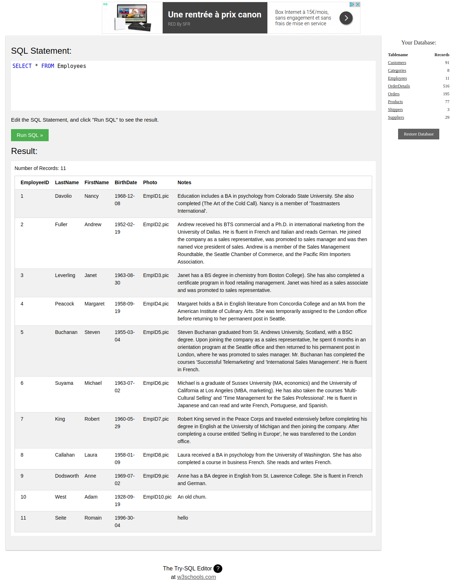
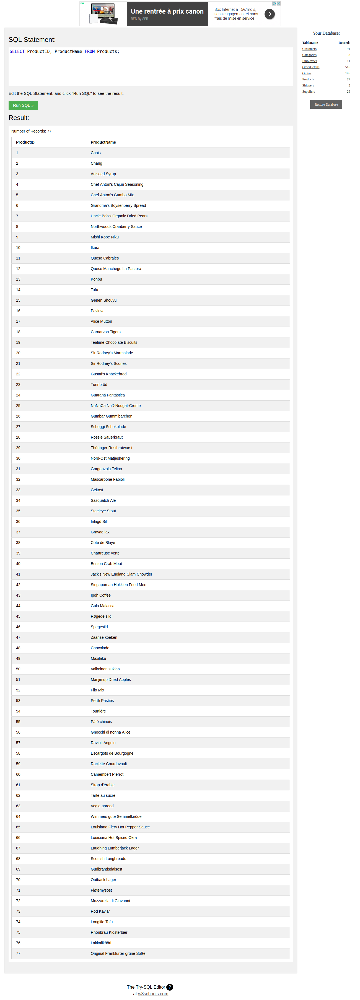
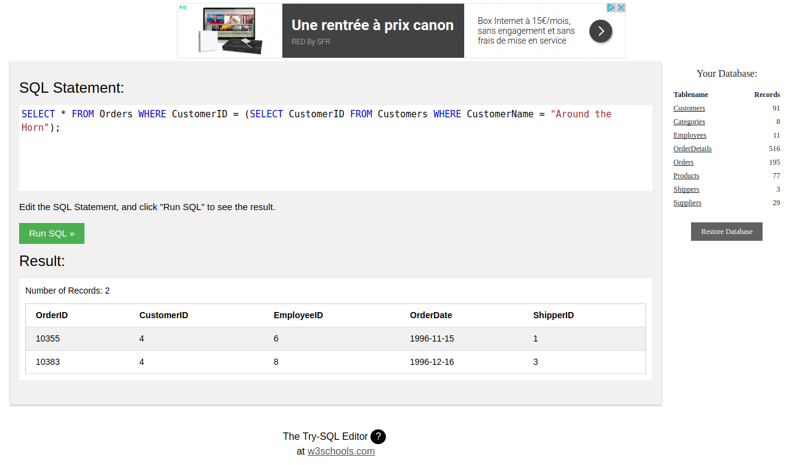
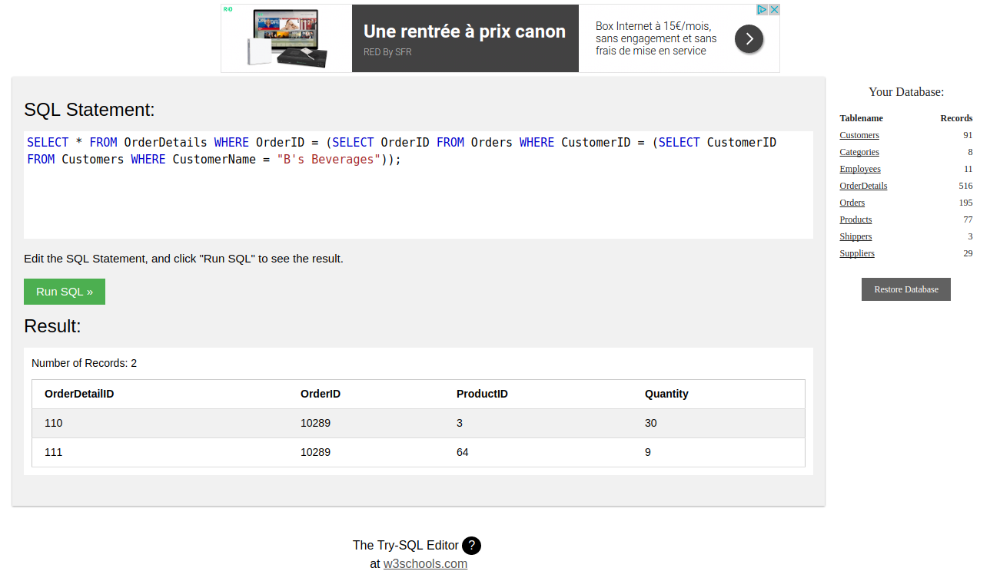
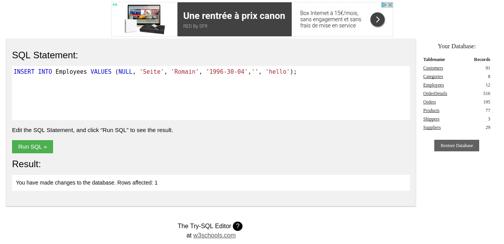
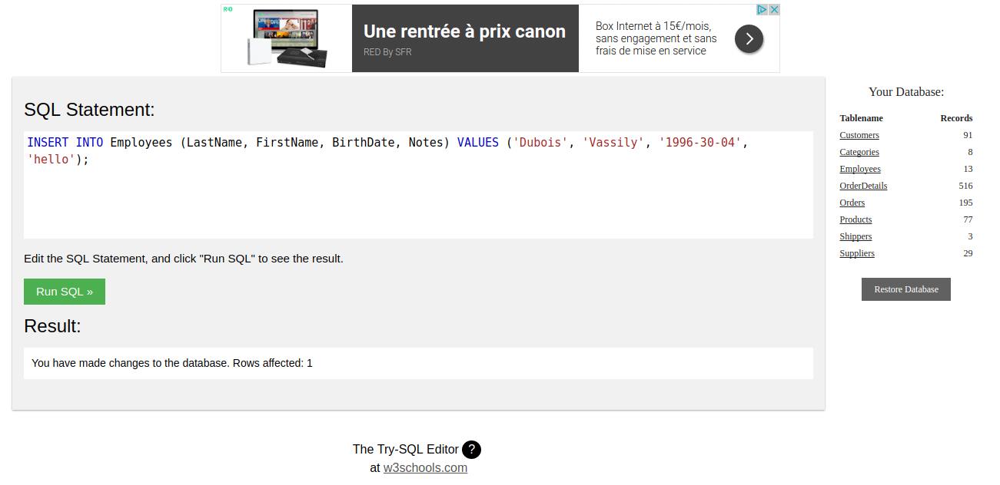
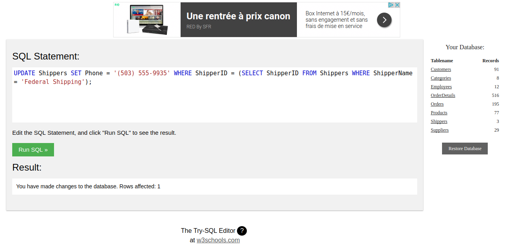
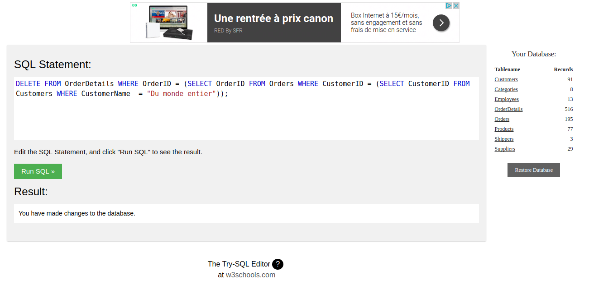
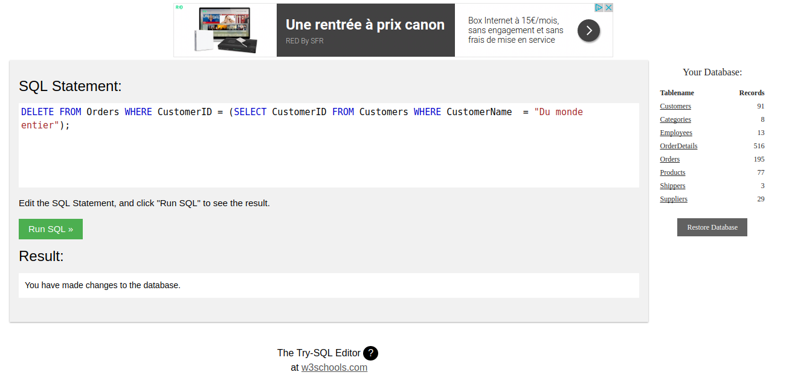
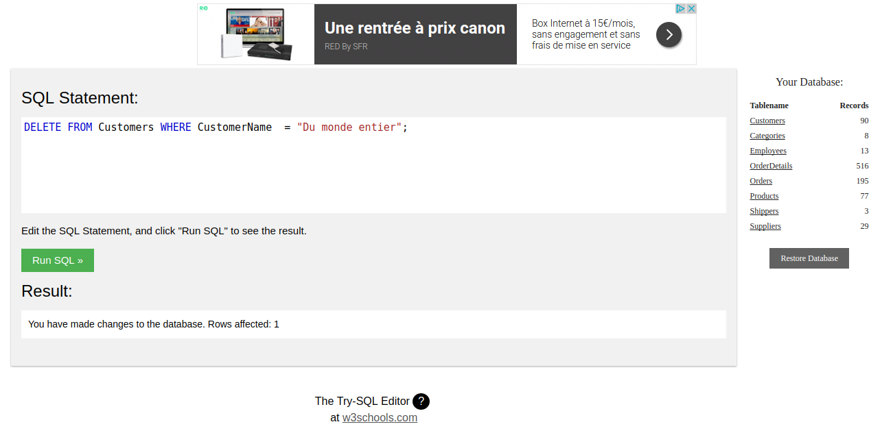
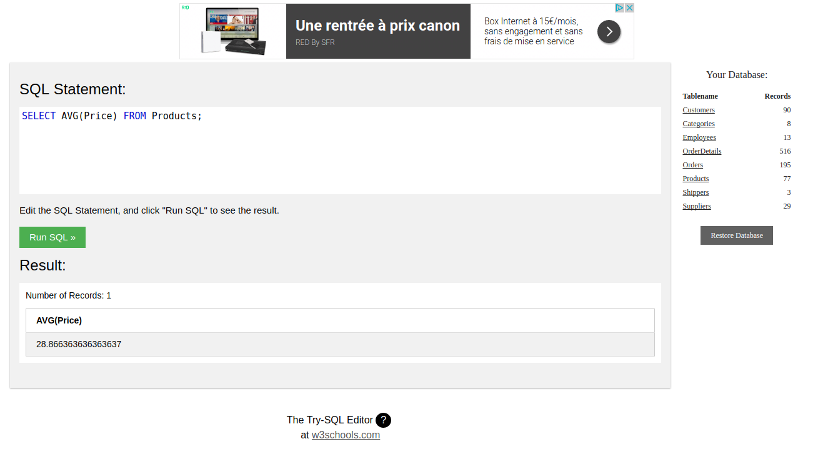
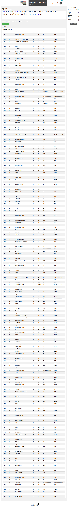
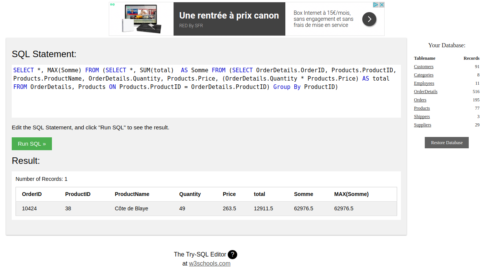